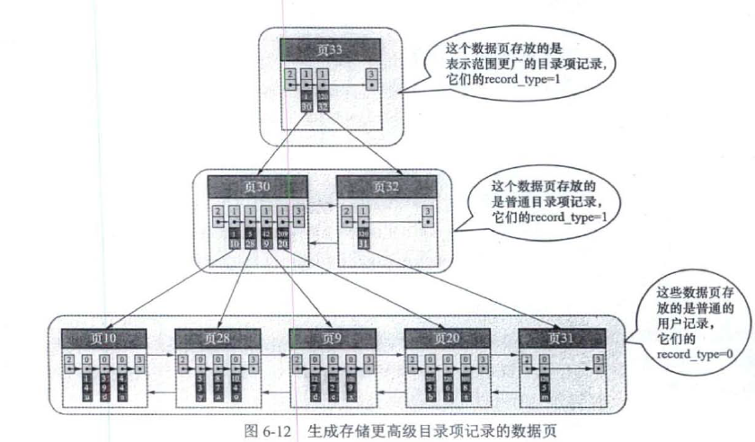

# SQL

## 数据类型

数字类型, 日期类型, 字符串类型, 地图坐标类型, JSON类型

## DDL

## DML

# 索引

## B+树

### 结构

* 目录项存子节点最左边的索引, 值存页号
* 聚簇索引的叶子节点存原始数据

### 分类

* 聚簇索引(主键)
* 二级索引
* 联合索引

### 使用B+树的原因

https://draveness.me/whys-the-design-mysql-b-plus-tree/

* 哈希虽然能够提供 `O(1)` 的单数据行操作性能，但是对于范围查询和排序却无法很好地支持，最终导致全表扫描；
* B 树能够在非叶节点中存储数据，但是这也导致在查询连续数据时可能会带来更多的随机 I/O，而 B+ 树的所有叶节点可以通过指针相互连接，能够减少顺序遍历时产生的额外随机 I/O；

B+树在连续的范围读取具有较大的优势, 虽然使用B+树会增加树一点高度, 但这并不是影响性能的关键因素。然而高度为 3 的 B+ 树就能够存储千万级别的数据，实践中 B+ 树的高度最多也就 4 或者 5，所以这并不是影响性能的根本问题

## 索引失效的场景

* 未遵循最左匹配原则
* 未将索引放到单独的列(对索引使用函数, 用索引进行计算, 类型转化索引)
* 使用`select *`
* 使用or但未对两边的列全都构建索引 (select id from user where id=1 or height='175' or address='成都';, address上没有索引, 走全表查询)
* 两个列进行比较
* order by顺序出错或者不加where和limit, 都会走全表

## 更好的创建使用索引

* 将索引项单独放在比较符的一侧
* 选择合适的唯一性好并且长度短的前缀索引
* 不要对每个where子句中的列单独构建索引, 经过优化器后很可能会对这些索引进行集合运算, 而优化器不会将这些计算的消耗加入到"查询成本", 看到索引合并时应当检查查询和表的结构, 合理设计索引
* **最左匹配原则**, 合适的索引列顺序
* **覆盖索引**, 构建联合索引包含查询要用到的字段从而避免回表操作
* **索引下推**, 构建联合索引包含查询条件语句中的字段, 从而在扫描索引时就能进行其他条件的判断, **下推**其实就是指将部分上层（服务层）负责的事情，交给了下层（引擎层）去处理
* 利用索引排序同时最好结合Limit
* 压缩索引, 例如第一个值是"perform", 第二个值是"performance", 存储第二个值时可以是"7,ance", 索引压缩可能只需要十分之一的磁盘空间, 但是在索引查找上却慢上好几倍, 所以要基于服务是计算密集型还是IO密集型的判断进行选择是否开启
* 消除冗余重复的索引
* **使用自增主键**, 减少不必要的页分裂

# Join的工作原理

# 优化器

## 基于成本的优化

## 基于规则的优化

## 查询执行计划

## 查询执行计划的计算过程

# Buffer Pool

# 日志

# 事务

# 锁

