[TOC]

# TCP

## 特点

* 面向连接: 在使用tcp前必须先建立tcp连接
* 点对点: 无法用于广播,多播
* 提供可靠的交付服务: 可靠有序, 不丢不重
* 基于全双工通信: 两端可以同时发送数据
* 面向字节流: 一个字节一个编号

## TCP报文段首部格式

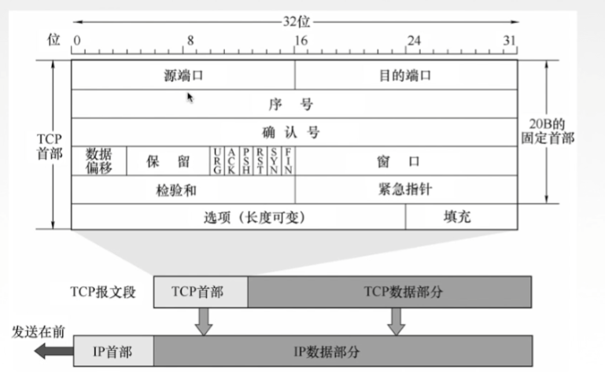

* 序号: 所发送数据的第一个字节的序号
* 确认号: 接受方期望收到对方下一个报文段的第一个数据字节的序号
* 数据偏移(首部长度): 数据段的起始位置, 也指代头部大小
* 标志字段
  1. URG: 紧急位, 置为 1 时表示报文中有高优先级数据, 与紧急指针配合使用
  2. ACK: 置为 1 时确认号有效, 连接建立后所有报文段ACK都置1
  3. PSH: 推送位, 置 1 时接收方尽快交付给应用进程, 不再等待缓存填满
  4. RST: 置 1 时表示 TCP 连接中出现异常必须强制断开连接
  5. SYN: 置 1 表示该报文为一个连接请求/连接接受的报文
  6. FIN: 置 1 表示发送方数据已发完, 要求释放连接
* 窗口: 发送此报文一方的接收窗口大小
* 校验和: 校验首部+数据, 同时加上 12B 的伪首部, 同UDP的校验计算方式
* 紧急指针: 紧急数据的字节数, 也代指紧急数据的末尾
* 选项: 最大报文段长度MSS, 窗口扩大, 时间戳, 选择确认...

(实践中, URU, PSH 以及紧急指针并没有使用)

## 连接管理

### 半连接队列和全连接队列

在 TCP 三次握手的时候，Linux 内核会维护两个队列，分别是：

- 半连接队列，也称 SYN 队列；
- 全连接队列，也称 accept 队列；

服务端收到客户端发起的 SYN 请求后，**内核会把该连接存储到半连接队列**，并向客户端响应 SYN+ACK，

接着客户端会返回 ACK，服务端收到第三次握手的 ACK 后，**内核会把连接从半连接队列移除，然后创建新的完全的连接，并将其添加到 accept 队列，等待进程调用 accept 函数时把连接取出来。**

不管是半连接队列还是全连接队列，都有最大长度限制，超过限制时，内核会直接丢弃，或返回 RST 包。(开启SYN cookie在半连接队列满后会使用syn cookie的形式进行连接)

### 连接建立(三次握手)

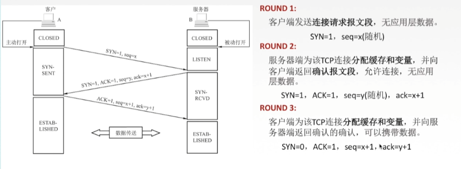

(ROUND 3 可以携带正式要发送的数据)

### 连接释放(四次挥手)

TCP双方中任何一方都可以主动终结连接

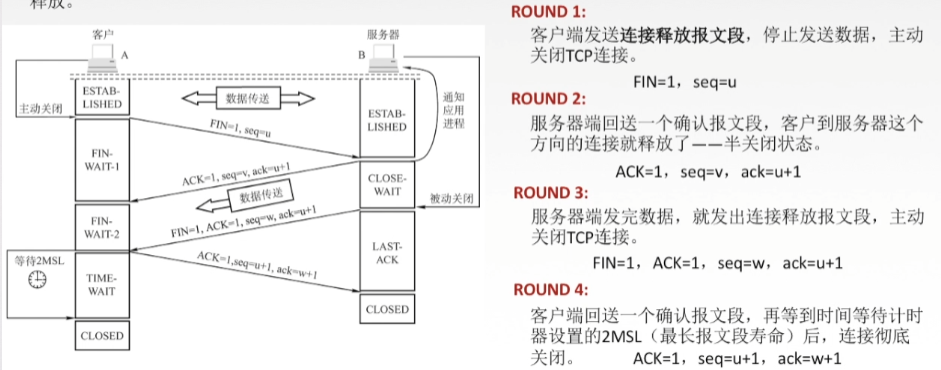

* v 的值取决于发送方自己上一次发送的报文数据末尾序号( v-1 ), w 同理取决于ROUND 2
* TIME-WAIT 设置为 2MSL 的原因:  假设ROUND 4的报文传送过程中丢失, 服务器会重新发送ROUND 3, 如果 TIME-WAIT 小于 2MSL 客户端已经关闭连接而无法重新发送ROUND 4

## 可靠传输

### 停等协议

发送方在未接受到对方的回应报文时一直处于待机状态, 直到收到对方的报文或者超时

#### rdt3.0

具有校验和, ACK, Seq(序号), FSM(倒计时定时器) 功能

分组序号在 0 和 1 之间交替 (由此有时rdt3.0也被称为比特交替协议,  可以视为双方窗口大小为 1 的滑动窗口协议)

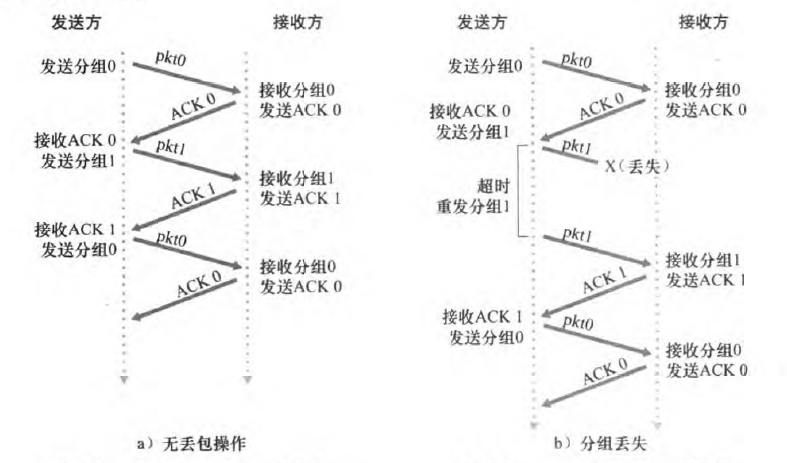

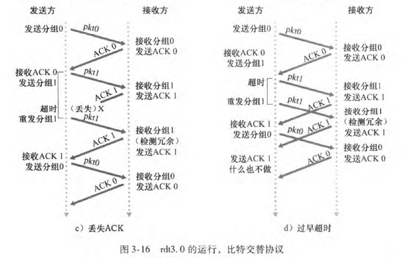

### 流水线机制

rdt3.0没有利用等待时间, 发送方大部分时间空闲没有发送数据, 导致物理资源的利用率很低

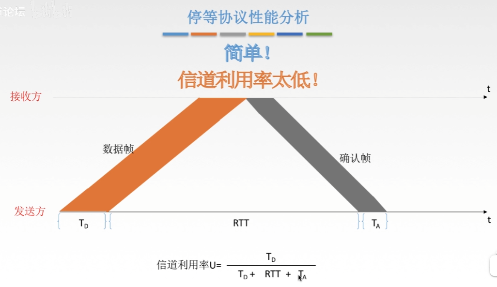

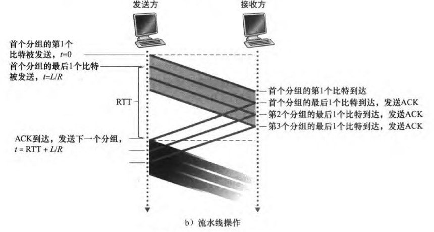

* 必须增加序号范围
* 需要缓存多个分组

实现方案: GBN以及SR

### 滑动窗口协议

#### GBN(回退N步)

窗口情况: 发送方N个, 接收方 1 个

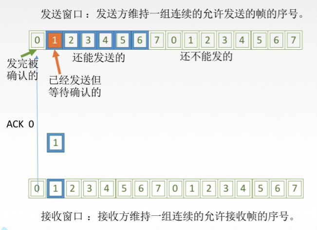

发送方三种响应事件

* 上层的调用。上层要发送数据，发送方会检查发送窗口是否已满。
  如果**未满**，则产生一个分组并发出
  如果**已满**，发送方将数据返回给上层，**暗示**上层窗口已满，等待重发。(实际实现中, 发送方可以缓存这些数据)
* 收到ACK。GBN采用**累计确认**的方式，收到 ACK=n 表示接收方已经收到 n 号以及之前的分组(与tcp有些许不同), 并将窗口向后移动
* 超时事件。超时定时器触发时，发送方重传所有已发送但未被确认的分组

接收方的两种响应事件

* 正确收到希望的n号分组。接受数据并交付给上层，同时回复一个 ACK=n
* 其余情况都丢弃分组(数据错误, 数据分组号不是期望的)，并发送ACK = 最近按序接受的分组号

发送窗口的大小可以无限吗?

不能。

假设用 2 个 B 对分组进行编号(因此编号范围为 `[0, 3]` ，**窗口大小应为** `[1, 3]` )，同时令发送窗口大小为 4。发送方发送 0~3 分组, 接收方接受并返回4个ack, 如果此时 4 个 **ACK全部丢失**, 发送方超时重传 0~3 分组, 接受方**无法判断这些分组是旧的分组还是新的分组**

#### SR (选择重传协议)

窗口情况: 发送方N个, 接收方N个 (双方窗口最好相等,  N最大为 `[最大编号值/2]`)

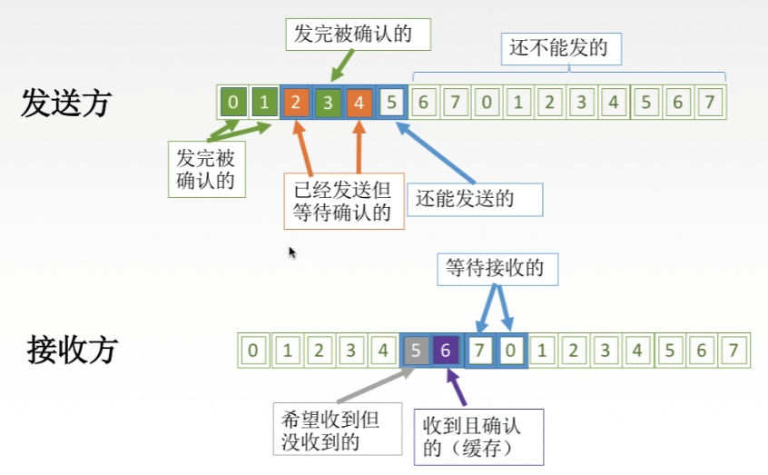

(注: 该图上下方未相关)

发送方三种响应事件:

* 上层的调用。同GBN
* 收到ACK。与GBN不同的是，SR只标记对应ACK的序号
* 超时重发。与GBN不同的是，SR每个发出的分组各自都有一个计时器，超时时只发送对应的分组

接收方的两种响应事件:

* 正确收到窗口内的分组。接收分组，发送对应ACK
* 收到小于窗口下界的分组，返回对应ACK
*  其他情况，丢弃

### TCP可靠传输过程

#### 基本机制

* 校验: 同UDP
* 序号: 一个字节占一个序号, 序号字段指报文段第一个字节的序号
* 确认
* 重传

确认重传不分家, TCP的机制类似于GBN和SR但不完全相同。

#### 超时时间

* 超时时间计算：一种**加权平均往返时间计算**,  随机采样一个已发送但未确认的报文，不采样重传的报文，再通过表达式进行计算(《计算机网络自顶向下》tcp章节中详细介绍了该计算方法)
* **超时时间加倍**：TCP每次超时重传都会把超时时间设置为先前的**两倍**，因此每次重传超时时间程指数级增长，是一种受限的拥塞控制

#### 选择确认

* SACK: 与SR有细微不同, ACK返回的是最小未接收的序号, 用SACK字段告诉发送方刚刚接受的报文段序号
* DSACK: ACK同样是返回最小未接收的序号,  但SACK字段返回的是连续已接收到的报文段序号区间

SACK

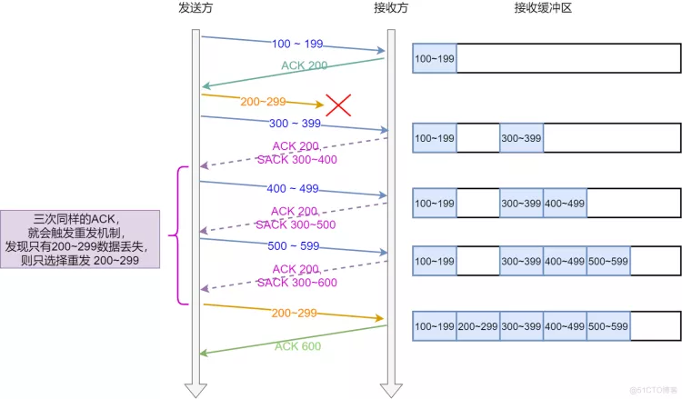

DSACK

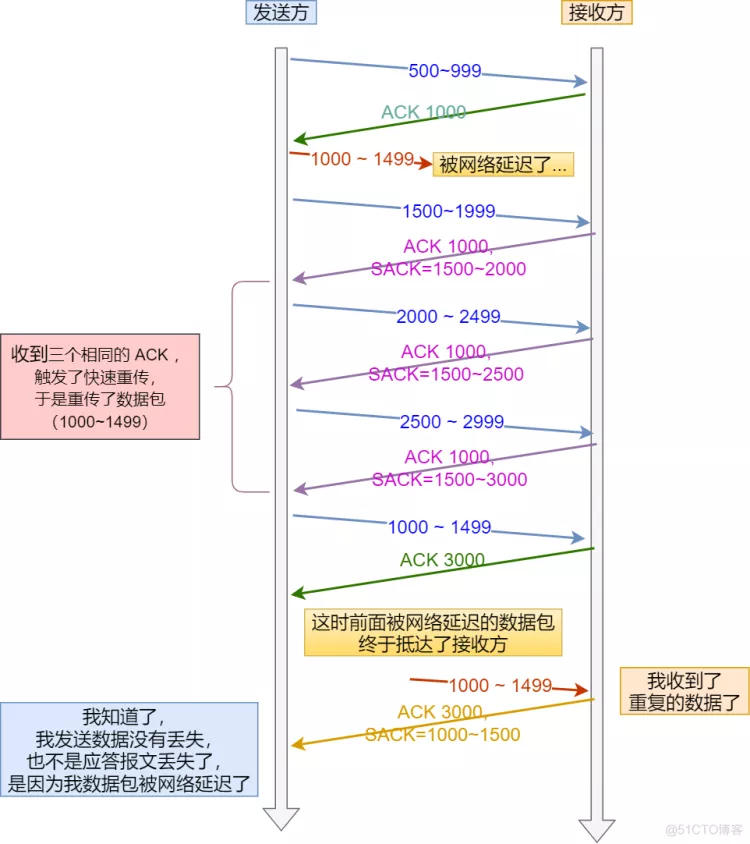

## TCP流量控制

> 避免「发送方」的数据填满「接收方」的缓存

### 通过窗口控制流量

传输层的功能是由操作系统来提供的, 接收方接收到的数据可能还没有及时被应用读取, 接收方的窗口就会不断缩小

TCP使用一个 rwnd 变量来控制发送方的发送窗口, 防止发送窗口超过接收窗口

### 零窗口问题

当接收方通知发送方接收窗口为 0 时, 发送方停止发送数据, 直到接收方ACK通知发送方窗口大小非0后才继续发送未发送完的数据

解决潜在的死锁:

在发送方收到接收窗口为0的ACK后, 启动持续计时器, 计时器激活时:

- 如果接收窗口仍然为 0，那么收到这个报文的一方就会重新启动持续计时器；
- 如果接收窗口不是 0，那么死锁的局面就可以被打破了。

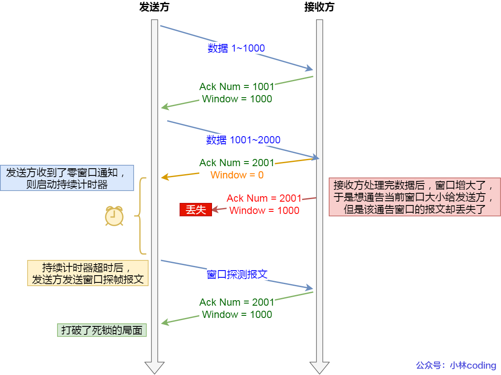

### 粘包问题

>  https://segmentfault.com/a/1190000039691657

#### 粘包问题的本质

使用者无法区分数据的边界

#### 产生粘包问题的原因

* 发送方开启了Nagle算法

  * 如果包长度达到`MSS`（或含有`Fin`包），立刻发送，否则**等待**下一个包到来；如果下一包到来后两个包的总长度超过`MSS`的话，就会进行拆分发送；
  * 等待超时（一般为`200ms`），第一个包没到`MSS`长度，但是又迟迟等不到第二个包的到来，则立即发送。

  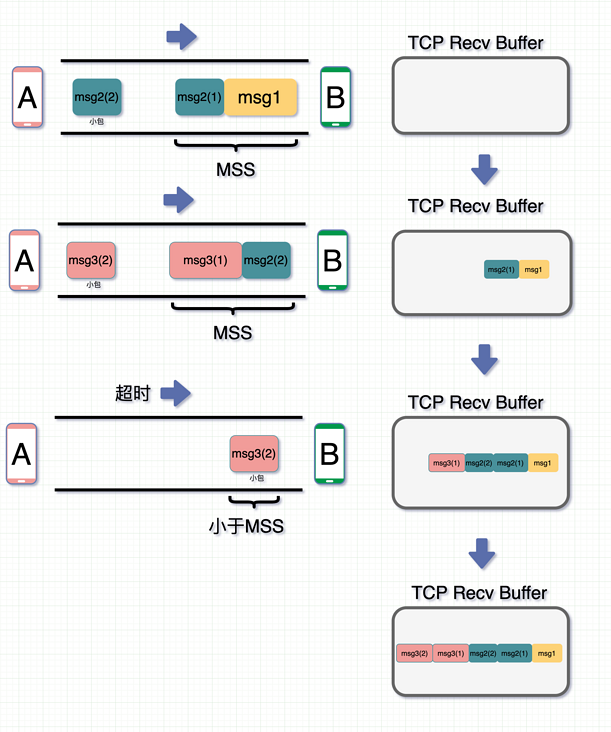

* 接收方来不及取走接收缓冲区的数据, 导致粘包

#### 粘包问题解决方案

* 在报文前后加入特殊标志符
* 报文首部加入长度信息,  一般配合上面的特殊标志一起使用，在收到头标志时，里面还可以带上消息长度，以此表明在这之后多少 byte 都是属于这个消息的

**解决特殊标识符存在于实体时的情况**

一般除了这个标志位，发送端在发送时还会加入各种校验字段（`校验和`或者对整段完整数据进行 `CRC` 之后获得的数据）放在标志位后面，在接收端拿到整段数据后校验下确保它就是发送端发来的完整数据

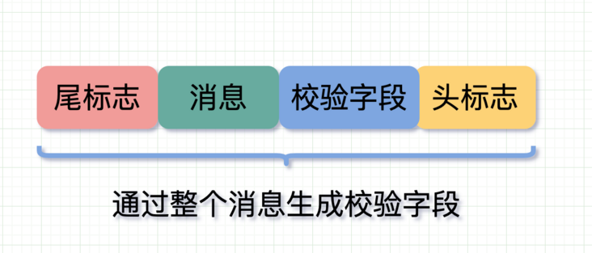

## TCP拥塞控制

(1) TCP引入**拥塞窗口 cwnd**,  这是发送方维护的一个的状态变量，它会根据**网络的拥塞程度动态变化的**

(2) swnd = min(rwnd, cwnd)

(3) 如何判断网络中出现拥塞?  **发生了超时重传，就会认为网络出现了拥塞。**

(4) cwnd变化趋势

* 只要网络中没有出现拥塞，`cwnd` 就会增大；
* 但网络中出现了拥塞，`cwnd` 就减少；

### 慢启动

慢启动算法规则:  **当发送方每收到一个 ACK**，拥塞窗口 cwnd 的大小就会加 1 (2个ACK加2, 4个加4)

cwnd呈指数级增长

控制慢启动快速增长的状态变量: **慢启动门限ssthresh**(slow start threshold, 一般来说 `ssthresh` 的大小是 `65535` 字节。): 

* 当 `cwnd` < `ssthresh` 时，使用慢启动算法。
* 当 `cwnd` >= `ssthresh` 时，就会使用「拥塞避免算法」。

### 拥塞避免

规则：**每当收到一个 ACK 时，cwnd 增加 1/cwnd**

拥塞窗口线性增长

现假定 `ssthresh` 为 `8`：

- 当 8 个 ACK 应答确认到来时，每个确认增加 1/8，8 个 ACK 确认 cwnd 一共增加 1，于是这一次能够发送 9 个 `MSS` 大小的数据，变成了**线性增长。**

### 快速重传(冗余ACK)

发送方积累收到 3 次相同的ACK后, 直接重传该序号的报文段而不等待超时定时器触发

### 快速回复

快速重传和快速恢复算法一般同时使用，快速恢复算法是认为，你还能收到 3 个重复 ACK 说明网络也不那么糟糕，所以没有必要像 `RTO` 超时那么强烈。

进入快速恢复之前，`cwnd` 和 `ssthresh` 已被更新了：

- `cwnd = cwnd/2` ，也就是设置为原来的一半;
- `ssthresh = cwnd`;

然后，进入快速恢复算法如下：

- 拥塞窗口 `cwnd = ssthresh + 3` （ 3 的意思是确认有 3 个数据包被收到了）；
- 重传丢失的数据包；
- 如果再收到重复的 ACK，那么 cwnd 增加 1；
- 如果收到新数据的 ACK 后，把 cwnd 设置为第一步中的 ssthresh 的值，原因是该 ACK 确认了新的数据，说明从 duplicated ACK 时的数据都已收到，该恢复过程已经结束，可以回到恢复之前的状态了，也即再次进入拥塞避免状态；

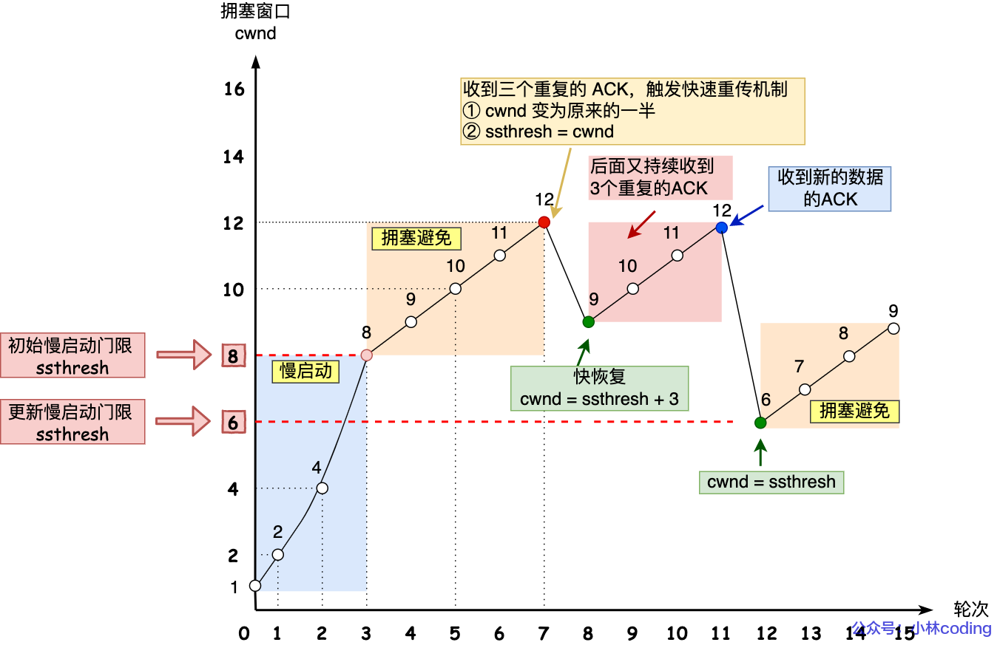

# UDP

## 特点

* 无连接。直接发送数据不维护连接状态
* 面向报文。应用程序给UDP多长的报文，UDP就照样发送，即一次发一个完整的报文，不做字节流的切割 (但是报文过大, ip可能会分多个分组传出, 导致性能降低。 而传输太短的报文也会导致传输的性价比降低)
* 不可靠交付。不保证数据到达和完整
* 无拥塞控制

## UDP报文首部

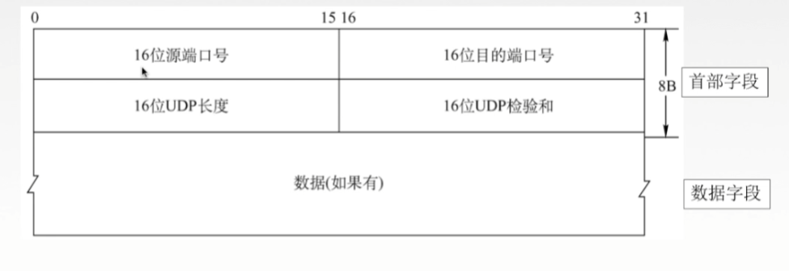

* 源端口号可不填
* 目的端口必填
* UDP长度指的是整个UDP报文的长度 = UDP首部 + 数据
* 校验和

## 校验和计算

### 伪首部

伪首部仅在计算校验和时存在，伪首部中的17指的是ip数据报中的协议字段 udp为17， 长度同udp中的长度

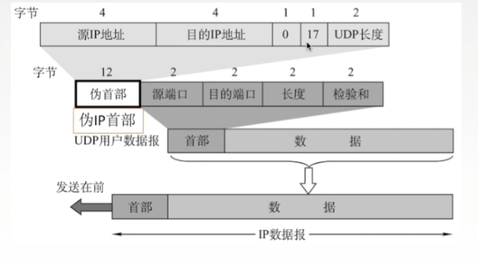

### 计算方法

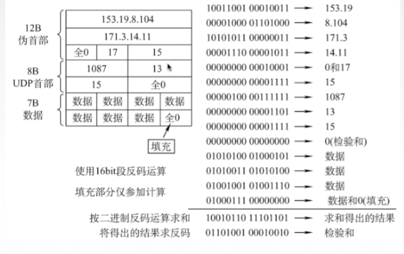

对其后全部相加，最后去反码即为校验和

# 补充

## UDP不分包传输, 如果UDP报文过大怎么办?

- TCP 的数据大小如果大于 MSS (1460B)大小，则会在传输层进行分片，目标主机收到后，也同样在传输层组装 TCP 数据包，如果中途丢失了一个分片，只需要传输丢失的这个分片。
- UDP 的数据大小如果大于 MTU(1500B) 大小，则**会在 IP 层进行分片**，目标主机收到后，在 IP 层组装完数据，接着再传给传输层。UDP的报文长度字段用两个字节表示, udp的理论最大长度为2^16 - 1 - 8 - 20 = 65507

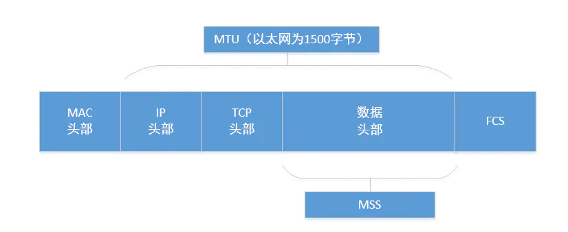

## TCP包大小的计算方式

**附: 为何udp不采取同样的计算方式, 而要多出一个字段来说明?**

说法不一。

* 地址对齐？
* 避免粘包？

## 为什么TCP三次握手不是两次或者四次

### 避免历史连接浪费导致被连接方资源被浪费

> *The principle reason for the three-way handshake is to prevent old duplicate connection initiations from causing confusion.*

1. 假设TCP仅握手两次
2. 假设客户端第一次发起TCP连接seq为100后, 很不幸客户端宕机同时该报文也堵塞在网络中
3. 假设客户端重启后又和服务器建立相同四元组的连接, 发出seq=200
4. 假设seq=100在seq=200之前到达, 服务器进行最后一次握手, 发送自己的seq序号, ack并且捎带实体数据

此时, 该ack=101会被客户端拒绝, 服务器也因此浪费了资源

三次握手便能很好的解决该问题, 在收到客户端的第三次握手报文之前, 服务器不会发送实体数据给客户端

### 同步序号

确认序号和告知客户端服务器序号可以合并为一个报文, 所以不需要四次握手

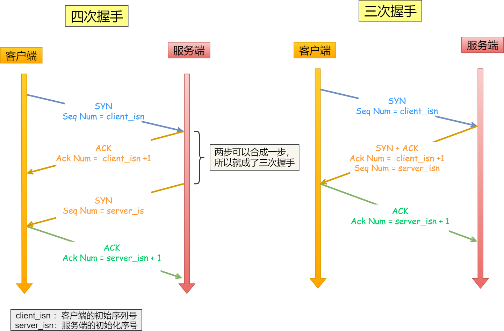

而如果两次握手, 只有客户端的序号得到了确认, 而服务端的序号无法保证被确认接受

## TCP每次初始化Seq随机的原因

如果TCP在建立连接时每次都选择相同的、固定的初始序号，那么设想以下的情况

1. 假定主机A和B频繁地建立连接，传送一些TCP报文段后，再释放连接，然后又不断地建立新的连接、传送报文段和释放连接。 
2. 假定每一次建立连接时，主机A都选择相同的、固定的初始序号，例如，选择1。
3. 假定主机A发送出的某些TCP报文段在网络中会滞留较长的时间，以致造成主机A超时重传这些TCP报文段。
4. 假定有一些在网络中滞留时间较长的TCP报文段最后终于到达了主机B，但这时传送该报文段的那个连接早已释放了．而在到达主机B时的TCP连接是一条新的TCP连接。

此时工作在新的TCP连接下的主机B就有可能会接受在旧的连接传送的、已经没有意义的、过时的TCP报文段(因为这个TCP报文段的序号有可能正好处在现在新的连接所使用的序号范围之中)。结果产生错误。 因此，必须使得迟到的TCP报文段的序号不处在新的连接中所使用的序号范围之中。 

 所以TCP在建立新的连接时所选择的初始序号一定要和前面的一些连接所使用过的序号不一样。

链接：https://www.zhihu.com/question/53658729/answer/255221757

## 为什么IP层会分片了, TCP还要MSS

IP层不具备重传机制, 丢失其中一个IP分片都要重传整个IP报文, 效率十分低下

为了达到最佳的传输效能 TCP 协议在**建立连接的时候通常要协商双方的 MSS 值**

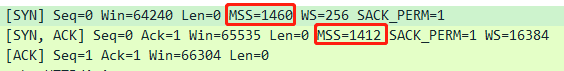

## 握手阶段的包丢失问题

### 第一次握手包丢失

操作系统有一个可设置的最大重传次数 n , 重发 n 次后依然超时就关闭TCP连接

重发的syn报文的seq都是相同的, 同时超时时间翻倍

### 第二次握手包丢失

双方都会触发重传机制(同第一次丢失)

### 第三次握手包丢失

此时, 客户端已经确认到了服务器的接发能力进入了ESTABLISHED, 而服务器还没有确认到客户端的接收能力

客户端不会重发ACK, 而服务器会进入重传机制, 重传SYN_ACK包

## SYN泛洪攻击防御

### SYN  COOKIE

开启syn cookie, 在半连接队列满了以后会使用syn cookie与客户端建立连接

SYN cookie生成方式: `hash(源ip地址,  目的ip地址, 目的端口号, 仅服务器持有的秘密数)`

防御过程:

* 收到一个SYN报文段, 此时不为该请求准备资源, 然后发送一个初始TCP序列号=生成的SYN cookie (服务器不记忆该cookie和其他任何信息, 相同目的ip和端口号时, cookie可以随时计算并且结果相同)
* 如果客户端合法, 返回的报文段中ACK值等于 cookie+1,  服务器则生成一个全开连接
* 如果没有接收到客户端报文或者cookie不合法, 服务器不必做任何回应, 此时初始的SYN并没有对服务器造成多大的损失

### 其他方式

* 调大netdev_max_backlog:  当网卡接收数据包的速度大于内核处理的速度时，会有一个队列保存这些数据包。控制该队列的最大值如下参数，默认值是 1000，我们要适当调大该参数的值，比如设置为 10000,  `net.core.netdev_max_backlog = 10000`
* 扩大半连接队列
* 减少SYN_ACK最大重传次数

## 挥手阶段的包丢失问题

### 第一次挥手丢失

客户端触发重传机制, 重传tcp_orphan_retries次后还没收到 ACK 则客户端直接进入CLOSE状态

### 第二次挥手丢失

ACK不会主动重发, 依旧是客户端触发重传同第一次挥手

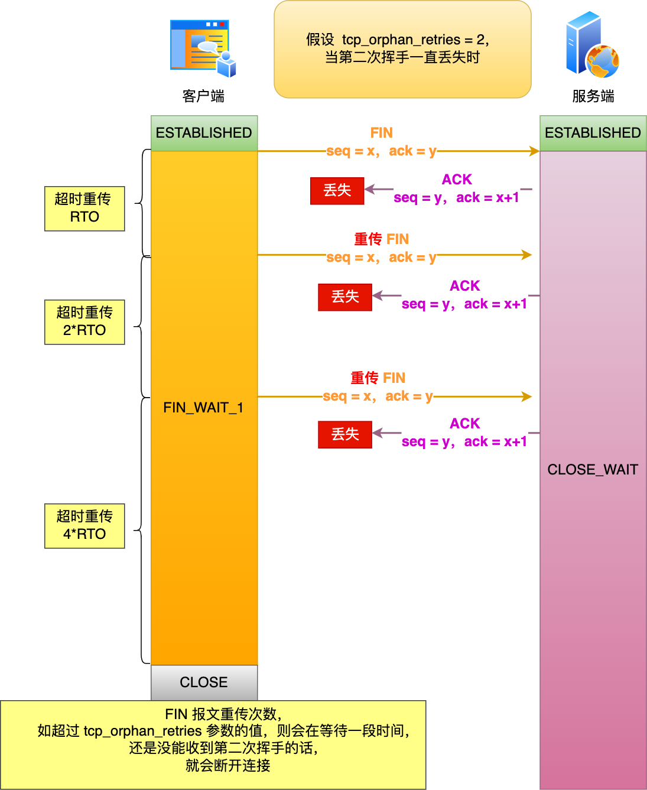

### 第三次挥手丢失

FIN包丢失, 服务端的行为类似于第一次挥手丢失

客户端通过close()关闭时, 会有个默认等待时间, 超过时间直接进入close状态

客户端通过shutdown()关闭时, 则不会有这个时间, 会持续等待FIN包

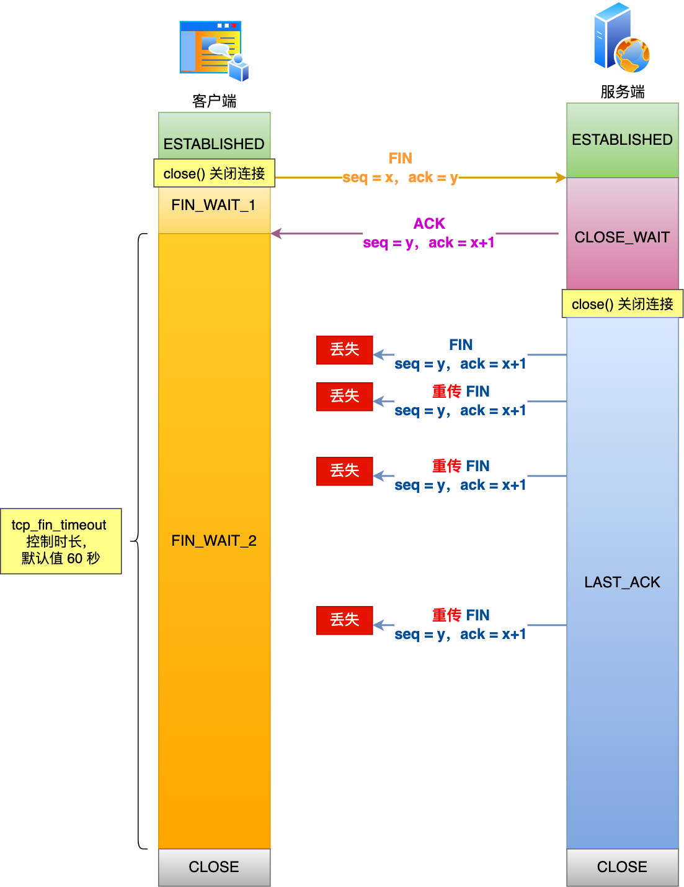

### 第四次挥手丢失

服务端同第三次挥手丢失

客户端收到FIN包后就会重传一次ACK, 然后重置2MSL定时器, 只有定时器触发时才进入CLOSE状态

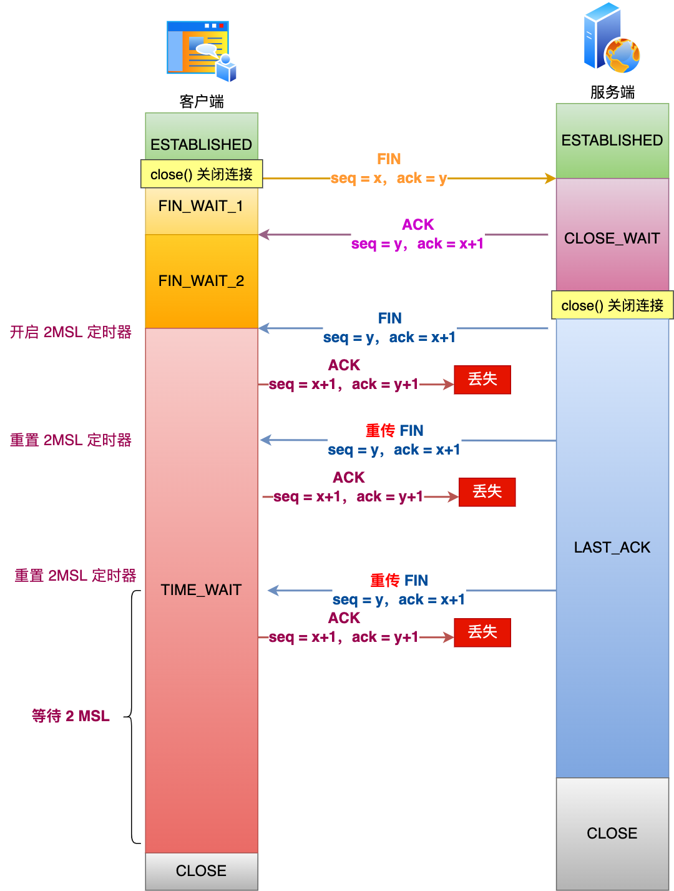

## TIME_WAIT

### MSL的含义

`MSL` 是 Maximum Segment Lifetime，**报文最大生存时间**，它是任何报文在网络上存在的最长时间，超过这个时间报文将被丢弃。

而 IP 头中有一个 `TTL` 字段，是 IP 数据报可以经过的最大路由数，每经过一个处理他的路由器此值就减 1，当此值为 0 则数据报将被丢弃，同时发送 ICMP 报文通知源主机。

**TTL 的值一般是 64，Linux 将 MSL 设置为 30 秒，意味着 Linux 认为数据报文经过 64 个路由器的时间不会超过 30 秒，如果超过了，就认为报文已经消失在网络中了**。

### 2MSL的设置意义

2MSL允许服务端进行一次FIN重传并让客户端重传ACK, 超过该时长则被认为该ACK已经到达或者消失在网络中。**也就是说, 2MSL状态能够防止新的连接将前一个连接的延迟报文段解释成自身数据的状况**

**防止历史连接中的数据，被后面相同四元组的连接错误的接收**

**保证「被动关闭连接」的一方，能被正确的关闭**

TIME-WAIT时间过长会浪费客户端资源, 过短会导致历史连接问题以及服务端非正常关闭终止

## TCP保活机制

### 机制介绍

如果在一段时间(称之为**保活时间**, keepalive time)内连接处于非活动状态, 开启保活功能的一端就是向对方发送一个**保活探测报文**(一个空报文段, seq=对方发送的ack报文的最大序号减一)

如果发送端没有收到探测报文的响应, 那么经过一个**保活时间间隔**(keepalive interval)后, 将继续发送一个探测报文, 直到达到**保活探测数**(keepalive probe), 这时对方主机将被认为不可到达, 连接关闭

**一般默认关闭**

### 为何TCP Keepalive无法替代应用层心跳保活机制

http://www.52im.net/thread-281-1-1.html

Keep Alive 机制开启后，TCP 层将在定时时间到后发送相应的 KeepAlive 探针以确定连接可用性。一般时间为 7200 s（详情请参见《[TCP/IP详解](http://docs.52im.net/extend/docs/book/tcpip/vol1/23/)》中[第23章](http://docs.52im.net/extend/docs/book/tcpip/vol1/23/)），失败后重试 10 次，每次超时时间 75 s。显然默认值无法满足我们的需求，而**修改过设置后就可以满足了吗？答案仍旧是否定的**。

因为 TCP KeepAlive 是用于检测连接的死活，而心跳机制则附带一个额外的功能：**检测通讯双方的存活状态**。两者听起来似乎是一个意思，但实际上却大相径庭。

考虑一种情况，某台服务器因为某些原因导致负载超高，CPU 100%，无法响应任何业务请求，但是使用 TCP 探针则仍旧能够确定连接状态，这就是典型的连接活着但业务提供方已死的状态，对客户端而言，这时的最好选择就是断线后重新连接其他服务器，而不是一直认为当前服务器是可用状态，一直向当前服务器发送些必然会失败的请求。

## TCP延迟确认

将多个ACK报文组合成一个ACK发出, 借此希望降低网络拥塞

- 当有响应数据要发送时，ACK 会随着响应数据一起立刻发送给对方
- 当没有响应数据要发送时，ACK 将会延迟一段时间，以等待是否有响应数据可以一起发送
- 如果在延迟等待发送 ACK 期间，对方的第二个数据报文又到达了，这时就会立刻发送 ACK

## TCP四次挥手是否可以变为三次

**「没有数据要发送」并且「开启了 TCP 延迟确认机制」，那么第二和第三次挥手就会合并传输，才会出现三次挥手。**

## ---SYN被丢弃的情况---

* 半连接队列满了, 并且没有开启syn cookie就会被直接丢弃
* 全连接队列满了, 此时无法拒绝新来的SYN和想要进入全连接队列的SYN

## ---TCP Fast Open--
