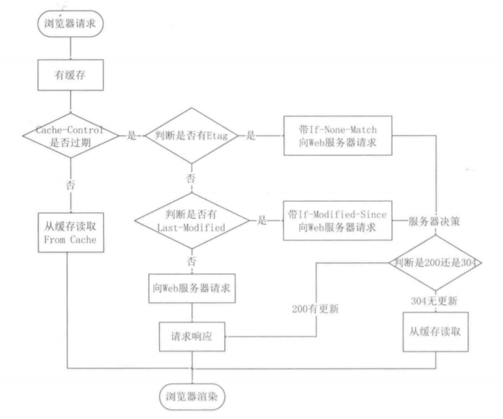
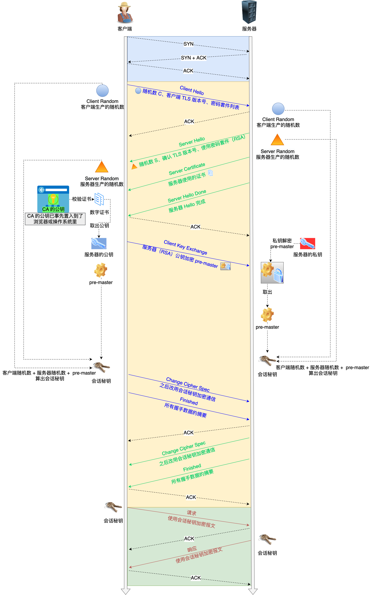
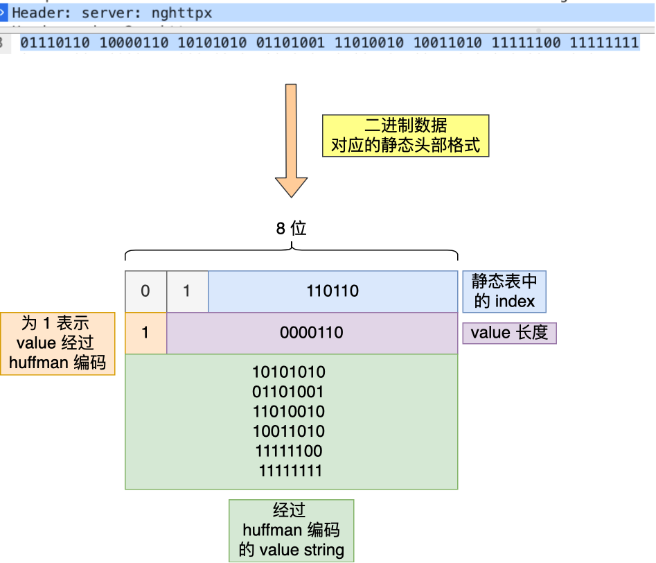
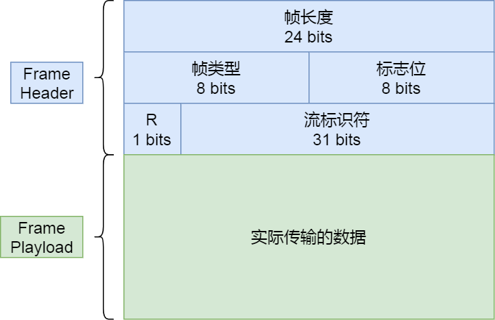
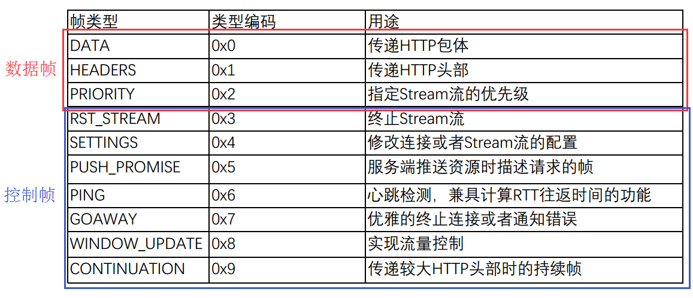
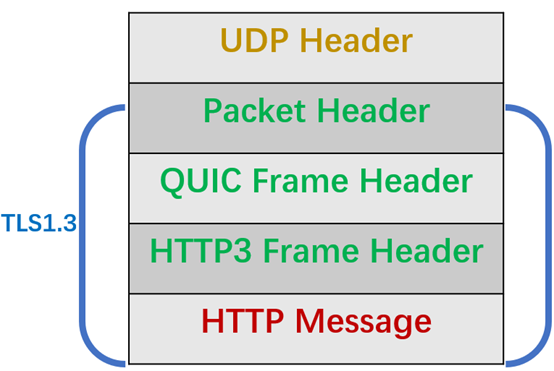
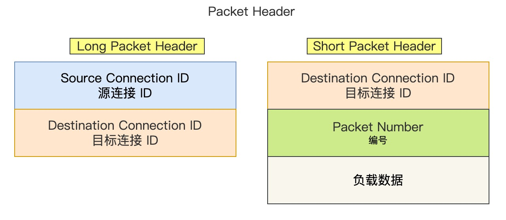
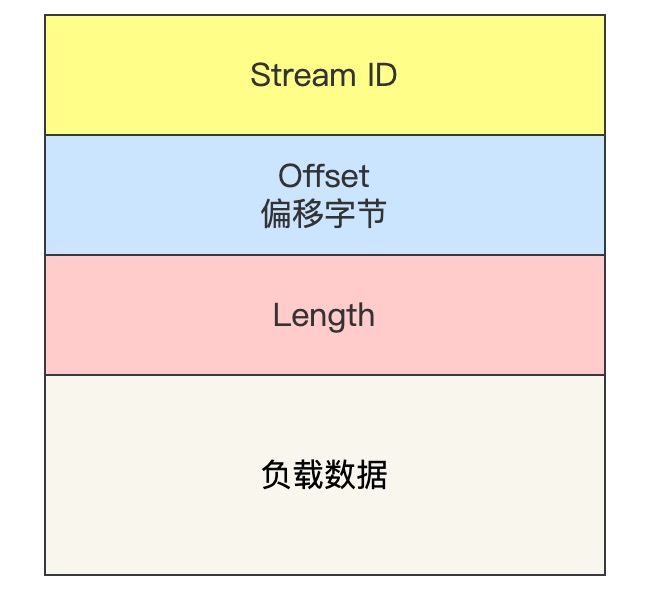

[toc]

# HTTP1.1

## 常见的状态码

`1xx` 类状态码属于**提示信息**，是协议处理中的一种中间状态，实际用到的比较少。

`2xx` 类状态码表示服务器**成功**处理了客户端的请求，也是我们最愿意看到的状态。

- 「**200 OK**」是最常见的成功状态码，表示一切正常。如果是非 `HEAD` 请求，服务器返回的响应头都会有 body 数据。
- 「**204 No Content**」也是常见的成功状态码，与 200 OK 基本相同，但响应头没有 body 数据。
- 「**206 Partial Content**」是应用于 HTTP 分块下载或断点续传，表示响应返回的 body 数据并不是资源的全部，而是其中的一部分，也是服务器处理成功的状态。

`3xx` 类状态码表示客户端请求的资源发生了变动，需要客户端用新的 URL 重新发送请求获取资源，也就是**重定向**。

- 「**301 Moved Permanently**」表示永久重定向，说明请求的资源已经不存在了，需改用新的 URL 再次访问。
- 「**302 Found**」表示临时重定向，说明请求的资源还在，但暂时需要用另一个 URL 来访问。

301 和 302 都会在响应头里使用字段 `Location`，指明后续要跳转的 URL，浏览器会自动重定向新的 URL。

- 「**304 Not Modified**」不具有跳转的含义，表示资源未修改，重定向已存在的缓冲文件，也称缓存重定向，也就是告诉客户端可以继续使用缓存资源，用于缓存控制。

`4xx` 类状态码表示客户端发送的**报文有误**，服务器无法处理，也就是错误码的含义。

- 「**400 Bad Request**」表示客户端请求的报文有错误，但只是个笼统的错误。
- 「**403 Forbidden**」表示服务器禁止访问资源，并不是客户端的请求出错。
- 「**404 Not Found**」表示请求的资源在服务器上不存在或未找到，所以无法提供给客户端。

`5xx` 类状态码表示客户端请求报文正确，但是**服务器处理时内部发生了错误**，属于服务器端的错误码。

- 「**500 Internal Server Error**」与 400 类型，是个笼统通用的错误码，服务器发生了什么错误，我们并不知道。
- 「**501 Not Implemented**」表示客户端请求的功能还不支持，类似“即将开业，敬请期待”的意思。
- 「**502 Bad Gateway**」通常是服务器作为网关或代理时返回的错误码，表示服务器自身工作正常，访问后端服务器发生了错误。
- 「**503 Service Unavailable**」表示服务器当前很忙，暂时无法响应客户端，类似“网络服务正忙，请稍后重试”的意思。

## GET和POST的安全幂等

- **GET 方法就是安全且幂等的**，因为它是「只读」操作，无论操作多少次，服务器上的数据都是安全的，且每次的结果都是相同的。所以，**可以对 GET 请求的数据做缓存，这个缓存可以做到浏览器本身上（彻底避免浏览器发请求），也可以做到代理上（如nginx），而且在浏览器中 GET 请求可以保存为书签**。
- **POST** 因为是「新增或提交数据」的操作，会修改服务器上的资源，所以是**不安全**的，且多次提交数据就会创建多个资源，所以**不是幂等**的。所以，**浏览器一般不会缓存 POST 请求，也不能把 POST 请求保存为书签**。

## 缓存

### 强制缓存

- `Cache-Control`， 是一个相对时间；
- `Expires`，是一个绝对时间；

会优先使用`Cache-control`

### 协商缓存

**协商缓存这两个字段都需要配合强制缓存中 Cache-control 字段来使用，只有在未能命中强制缓存的时候，才能发起带有协商缓存字段的请求**。

第一种 Last-Modified 和 If-Modified-Since

- 响应头部中的 `Last-Modified`：标示这个响应资源的最后修改时间；
- 请求头部中的 `If-Modified-Since`：当资源过期了，发现响应头中具有 Last-Modified 声明，则再次发起请求的时候带上 Last-Modified 的时间，服务器收到请求后发现有 If-Modified-Since 则与被请求资源的最后修改时间进行对比（Last-Modified），如果最后修改时间较新（大），说明资源又被改过，则返回最新资源，HTTP 200 OK；如果最后修改时间较旧（小），说明资源无新修改，响应 HTTP 304 走缓存。

第二种: Etag 和 If-None-Match

- 响应头部中 `Etag`：唯一标识响应资源；
- 请求头部中的 `If-None-Match`：当资源过期时，浏览器发现响应头里有 Etag，则再次向服务器发起请求时，会将请求头If-None-Match 值设置为 Etag 的值。服务器收到请求后进行比对，如果资源没有变化返回 304，如果资源变化了返回 200。

Etag优先级高于Last-Modified

\

## 长连接KeepAlive

减少TCP建立连接的次数, 在一次TCP连接中完成多个http请求

为了避免资源浪费的情况，web 服务软件一般都会提供 `keepalive_timeout` 参数，用来指定 HTTP 长连接的超时时间。如果客户端在完后一个 HTTP 请求后，在 `keepalive_timeout` 秒内都没有再发起新的请求，**定时器的时间一到，就会触发回调函数来释放该连接。**

## 流水线/管道网络传输

只要第一个请求发出去了，不必等其回来，就可以发第二个请求出去，可以减少整体的响应时间。

**但是服务器必须按照接收请求的顺序发送对这些管道化请求的响应**,  所以还会有响应队列堵塞的问题

## 身份认证问题

https://segmentfault.com/a/1190000022015600

https://blog.guokaiqiang.com/session-cookie-token/

http本身是无状态的, 所以需要用户来实现身份验证

### Session 和 Cookie

这是一种有状态的认证方法：服务端保存 Session 对象，客户端以 Cookie 形式保存 SessionID。

其交互过程如下：

1. 客户端在登录页面输入身份信息，如用户名/密码。
2. 服务端验证身份信息，通过后生成一个 Session 对象，保存到服务端，并将 SessionID 值以 Cookie 形式返回给客户端。
3. 客户端将接收到的 SessionID 保存到 Cookie 中，并且之后每次请求都在请求头中携带 SessionID Cookie。
4. 服务端从请求的 Cookie 中获取 SessionID，并查询其对应的 Session 对象，从而获得身份信息。
5. 客户端退出本次会话后，客户端删除 SessionID 的 Cookie，服务端删除 Session 对象。
6. 如果客户端之后要重新登录，需重新生成 Session 对象和 SessionID。

优点：

- 较安全：客户端每次请求时无需发送身份信息，只需发送 SessionID。
- 较高效：服务端无需每次处理请求时都要验证身份信息，只需通过 SessionID 查询 Session 对象。

缺点：

- 扩展性差，Session 对象保存在服务端，如果是保存在多个服务器上，有一致性问题，如果保存在单个服务器上，无法适应用户增长。
- 基于 Cookie 的 SessionID 不能跨域共享，同一用户的多个客户端（如浏览器客户端和 APP）不能共享 SessionId。
- 基于 Cookie 的 SessionID 易被截获生成 CSRF（Cross-site request forgery）跨站请求伪造。

### Token

https://shanyue.tech/post/jwt-guide.html#session

客户端首先将用户信息发送给服务端，服务端根据用户信息+私钥生成一个唯一的 Token 并返回给客户端。Token 只保存在客户端，之后客户端的每个请求头中都携带 Token，而**服务端只通过运算**（无需查询）来验证用户。

优点：

- Token 只保存在客户端，因此不影响服务端扩展性。
- 为用户生成的 Token 可以在多个客户端共用。
- token可以设置一个有效时间，定时刷新，并将使用过的token加入黑名单。但这也导致了Cookie没法主动失效，一定要等到设置的有效时间到了才能失效

缺点：

- Token 包含了用户的全部信息，不只是如 SessionID 类似的一个 ID 值，因此会增加每次请求包的大小。

一般使用JWT（JSON Web Token）

### 无感知刷新Token

双token

### Token设备管理

**当用户注销时，如何使该 token 失效**

因为 jwt 无状态，不保存用户设备信息，没法单纯使用它完成以上问题，可以再利用数据库保存一些状态完成。

- `session`: 只需要把 user_id 对应的 token 清掉即可
- `jwt`: 使用 redis，维护一张黑名单，用户注销时把该 token 加入黑名单，过期时间与 jwt 的过期时间保持一致。

**如何允许用户只能在一个设备登录，如微信**

- `session`: 使用 sql 类数据库，对用户数据库表添加 token 字段并加索引，每次登陆重置 token 字段，每次请求需要权限接口时，根据 token 查找 user_id
- `jwt`: 假使使用 sql 类数据库，对用户数据库表添加 token 字段(不需要添加索引)，每次登陆重置 token 字段，每次请求需要权限接口时，根据 jwt 获取 user_id，根据 user_id 查用户表获取 token 判断 token 是否一致。另外也可以使用计数器的方法，如下一个问题。

对于这个需求，session 稍微简单些，毕竟 jwt 也需要依赖数据库。

**如何允许用户只能在最近五个设备登录，如诸多播放器**

- `session`: 使用 sql 类数据库，创建 token 数据库表，有 id, token, user_id 三个字段，user 与 token 表为 1:m 关系。每次登录添加一行记录。根据 token 获取 user_id，再根据 user_id 获取该用户有多少设备登录，超过 5 个，则删除最小 id 一行。
- `jwt`: 使用计数器，使用 sql 类数据库，在用户表中添加字段 count，默认值为 0，每次登录 count 字段自增1，每次登录创建的 jwt 的 Payload 中携带数据 current_count 为用户的 count 值。每次请求权限接口时，根据 jwt 获取 count 以及 current_count，根据 user_id 查用户表获取 count，判断与 current_count 差值是否小于 5

对于这个需求，jwt 略简单些，而使用 session 还需要多维护一张 token 表。

**如何允许用户只能在最近五个设备登录，而且使某一用户踢掉除现有设备外的其它所有设备，如诸多播放器**

- `session`: 在上一个问题的基础上，删掉该设备以外其它所有的token记录。
- `jwt`: 在上一个问题的基础上，对 count + 5，并对该设备重新赋值为新的 count。

**如何显示该用户登录设备列表 / 如何踢掉特定用户**

- `session`: 在 token 表中新加列 device
- `jwt`: 需要服务器端保持设备列表信息，做法与 session 一样，使用 jwt 意义不大

## 优化HTTP1.1

### 避免发送请求

缓存机制

### 减少请求次数

* 合并请求: 合并资源，以一个大资源的请求替换多个小资源的请求。
* 延迟请求: 懒加载
* 减少重定向请求次数: 将重定向的任务交给代理服务器

### 减少响应数据大小

* 有损压缩: 多媒体数据
* 无损压缩:  Brotli(google 推出的压缩算法, 压缩效果好于gzip), gzip

# HTTPS

## 数字证书

### 数字证书的内容

- 公钥；
- 持有者信息；
- 证书认证机构（CA）的信息；
- CA 对这份文件的**数字签名**及使用的算法；
- 证书有效期；
- 还有一些其他额外信息；

### CA 签发证书的过程

- 首先 CA 会把持有者的公钥、用途、颁发者、有效时间等信息打成一个包，然后对这些信息进行 Hash 计算，得到一个 Hash 值；
- 然后 CA 会使用自己的私钥将该 Hash 值加密，生成 Certificate Signature，也就是 CA 对证书做了签名；
- 最后将 Certificate Signature 添加在文件证书上，形成数字证书；

### 客户端校验服务端的数字证书的过程

- 首先客户端会使用同样的 Hash 算法获取该证书的 Hash 值 H1；
- 通常浏览器和操作系统中集成了 CA 的公钥信息，浏览器收到证书后可以使用 CA 的公钥解密 Certificate Signature 内容，得到一个 Hash 值 H2 ；
- 最后比较 H1 和 H2，如果值相同，则为可信赖的证书，否则则认为证书不可信。

### 验证证书

* 首先需要验证证书的签发机构, 如果是中间证书, 需要一直沿着证书链找到可信任的根证书
* 然后再开始校验服务器的数字证书

## RSA握手

一次建立发送了13个包



### 握手过程

* 第一次阶段: 客户端使用的 TLS 版本号、支持的密码套件列表，以及生成的**随机数（Client Random）**
* 第二次阶段: 服务器从客户端套件中选择算法再带上服务器的证书和随机数发给客户端
* 第三次阶段: 客户端验证证书, 提取服务器公钥, 生成一个**Pre-Master Secret**, 将 用服务器公钥加密过的PMS, **Change Cipher Spec**(告诉服务端开始使用加密方式发送消息), **Encrypted Handshake Message（Finishd）**(把之前所有发送的数据做个**摘要**，再用会话密钥（master secret）加密一下，让服务器做个验证，验证加密通信「是否可用」和「之前握手信息是否有被中途篡改过」。)
* 第四次阶段: 相同操作, 发送客户端Change Cipher Spec, Encrypted Handshake Message

「Change Cipher Spec」之前传输的 TLS 握手数据都是明文，之后都是对称密钥加密的密文。

### 前两个随机数的意义

防止**连接重放**

* 假设我们不设置这两个随机数
* 此时有个中间人捕获了客户端和服务器建立连接过程中的所有交互报文
* 攻击者无法解密但是它可以重放建立连接过程的数据报文
* 此时, 没有了两个随机数, 密钥仅有客户端的PMK指定, 所以最终产生的会话密钥会和上次合法连接时的相同
* 假设, 攻击者又截获了客户订购时的报文
* 他仍然无法解密, 但是却能生成一笔和正常连接时相同的交易

## ECDHE握手


```text
master_secret = PRF(pre_master_secret, "master secret",
                    ClientHello.random + ServerHello.random)
```

## ---TLS1.3---

# HTTP2

## HTTP1.1面临的问题

* 头部重复且未压缩
* 响应队头阻塞问题
* 不支持服务器推送数据

## 头部压缩

**HPACK** 算法，HPACK 算法主要包含三个组成部分：

- 静态字典
- Huffman 编码（压缩算法）
- 动态字典 (编号从62开始, 头部经过 Huffman 编码发送出去后，客户端和服务器双方都会更新自己的动态表, 一般如果字典达到预设上限, 服务器会通过断开连接来释放内存)



## 二进制格式

把原来的 `Header+Body` 的消息打散为数个小片的 **二进制「帧」**（Frame），用 `HEADERS` 帧存放头数据、`DATA` 帧存放实体数据。

/http2-二进制格式.png)

### frame格式



### frame类型

HTTP2共规定了10种类型



## 流传输/并发传输

多个 Stream 跑在一条 TCP 连接，同一个 HTTP 请求与响应是跑在同一个 Stream 中，HTTP 消息可以由多个 Frame 构成， 一个 Frame 可以由多个 TCP 报文构成。

在流的层面上看，消息是一些有序的帧序列，而在 TCP 连接的层面上看，消息却是乱序收发的帧。多个请求响应之间没有了顺序关系，也就不会出现浏览器中的排队等待，也不会出现队头阻塞问题，降低了延迟，提高了连接的利用率。

## 服务器主动推送资源

* 客户端发起的请求，必须使用的是奇数号 Stream，服务器主动的推送，使用的是偶数号 Stream。
* 服务器在推送资源时，会通过 `PUSH_PROMISE` 帧传输 HTTP 头部，并通过帧中的 `Promised Stream ID` 字段告知客户端，接下来会在哪个偶数号 Stream 中发送包体。

# HTTP3

## HTTP2存在的问题

* **TCP队头堵塞**: HTTP/2 多个请求是跑在一个 TCP 连接中的，那么当 TCP 丢包时，整个 TCP 都要等待重传，那么就会阻塞该 TCP 连接中的所有请求。

  /http2阻塞.jpeg)

* **TCP和TLS握手无法结合**

* **网络迁移需要重新连接**

## QUIC实现可靠UDP

### QUIC的数据结构





- Long Packet Header 用于首次建立连接。
- Short Packet Header 用于日常传输数据。
- 与TCP不同的是, Packet Number是**严格递增**的, QUIC使用Stream ID + Offset来区分数据




* 对于Stream 类型的 Frame 格式，Stream 可以认为就是一条 HTTP 请求

### 没有队头堵塞的QUIC

**QUIC 给每一个 Stream 都分配了一个独立的滑动窗口，这样使得一个连接上的多个 Stream 之间没有依赖关系，都是相互独立的，各自控制的滑动窗口**。

/quic无阻塞.jpeg)

### 流量控制

QUIC 实现了两种级别的流量控制，分别为 Stream 和 Connection 两种级别：

- **Stream 级别的流量控制**：Stream 可以认为就是一条 HTTP 请求，每个 Stream 都有独立的滑动窗口，所以每个 Stream 都可以做流量控制，防止单个 Stream 消耗连接（Connection）的全部接收缓冲。
- **Connection 流量控制**：限制连接中所有 Stream 相加起来的总字节数，防止发送方超过连接的缓冲容量。

### 拥塞控制

QUIC 协议当前默认使用了 TCP 的 Cubic 拥塞控制算法（我们熟知的慢开始、拥塞避免、快重传、快恢复策略）

但是QUIC 处于应用层，所以就**可以针对不同的应用设置不同的拥塞控制算法**,  可以随浏览器更新，QUIC 的**拥塞控制算法就可以有较快的迭代速度**。

### 更快的连接建立

将连接建立和TLS握手同时进行以节省时间

### 迁移连接

QUIC不通过四元组进行通信, 而是通过**连接 ID**来标记通信的两个端点

所以只要用户端持有连接ID以及TLS密钥等会话信息, 就能在切换网络环境时复用之前的连接

## HTTP3

/http3frame.png)

* 帧格式进行了更新只需要维护帧类型和数据长度
* QPACK头部压缩依旧是静态表, 动态表, Huffman

**HTTP2中动态表是具有时序性的，如果首次出现的请求发生了丢包，后续的收到请求，对方就无法解码出 HPACK 头部，因为对方还没建立好动态表，因此后续的请求解码会阻塞到首次请求中丢失的数据包重传过来**。

HTTP/3 的 QPACK 解决了这一问题，那它是如何解决的呢？

QUIC 会有两个特殊的单向流，所谓的单向流只有一端可以发送消息，双向则指两端都可以发送消息，传输 HTTP 消息时用的是双向流，这两个单向流的用法：

- 一个叫 QPACK Encoder Stream， 用于将一个字典（key-value）传递给对方，比如面对不属于静态表的 HTTP 请求头部，客户端可以通过这个 Stream 发送字典；
- 一个叫 QPACK Decoder Stream，用于响应对方，告诉它刚发的字典已经更新到自己的本地动态表了，后续就可以使用这个字典来编码了。

这两个特殊的单向流是用来**同步双方的动态表**，编码方收到解码方更新确认的通知后，才使用动态表编码 HTTP 头部。

# DNS

## 递归查询

递归查询是一种DNS 服务器的查询模式，在该模式下DNS 服务器接收到客户机请求，必须使用一个准确的查询结果回复客户机。如果DNS 服务器本地没有存储查询DNS 信息，那么该服务器会询问其他服务器，并将返回的查询结果提交给客户机。

## 迭代查询

DNS 服务器另外一种查询方式为迭代查询，DNS 服务器会向客户机提供其他能够解析查询请求的DNS 服务器地址，当客户机发送查询请求时，DNS 服务器并不直接回复查询结果，而是告诉客户机另一台DNS 服务器地址，客户机再向这台DNS 服务器提交请求，依次循环直到返回查询的结果

实践中, 通常是递归和迭代结合: 从请求主机到本地DNS服务器查询是递归的, 然后本地DNS服务器再使用迭代查询

# ---网络攻防---

## CSRF

https://tech.meituan.com/2018/10/11/fe-security-csrf.html

CSRF（Cross-site request forgery）跨站请求伪造

## XSS

https://tech.meituan.com/2018/09/27/fe-security.html

## 重放

中间人

抓包工具的原理

伪装客户, 服务